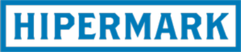
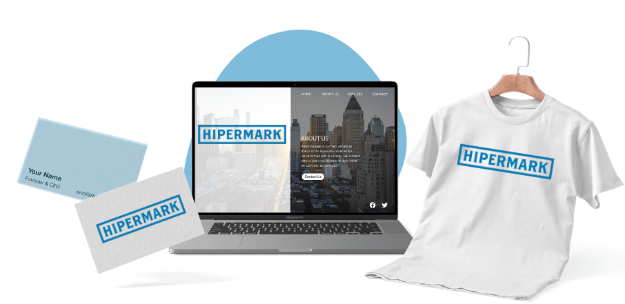
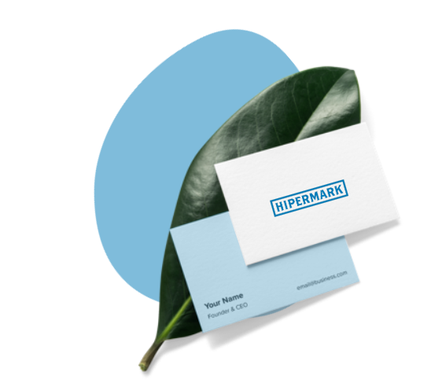
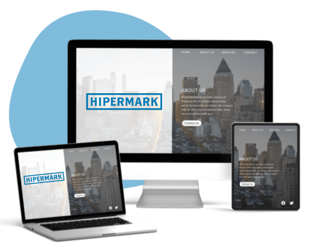

# HiperMARK

## DESCRIPCIÓN GENERAL

### Introduccion
Inicialmente, en septiembre de 2023, el objetivo principal de este proyecto era crear un
Sitio Web para ayudar a mi padre, siempre está buscando los precios de las demás competencias en los diferentes supermercados quue comercializa el producto.

#### ¿Por qué has elegido este tema?
He legido este tema, pensado en los empresarios que trabajan en la parte comercial del producto. Así verán el rango de precios de la competencia de los demas productos de marca y estudiar estos.

#### Quiero transmitir 
Una página **web, clara y sencilla** de entender hasta para los más negados en redes y dispositivos electrónicos.
Ayudar a los comerciales a mejorar su calidad de trabajo, restandoles tiempo en la busqueda de precio, de los productos de las demasd compentencias.

### Ganancias
Este Sitio Web, obtendrá beneficios de las empresas que quieran que salgan los productos en nuestra página web. 

### Contenidos y estructura del sitio web
- Web corporativa
- Galería de imágenes
- Enlace a las empresas y comercios
- Formularios de contacto


Aquí va un [enlace](https://google.es) hacia nuestro Sitio Web .


---
<br>

## DISEÑO WEB

### Colores principales de la página web
La elección de un tono principal azul y el color Ivory como tono secundario para una página web de negocios puede ser una decisión estratégica acertada por varias razones:

- Profesionalismo: El hex que es un derivado del azul, es un color que generalmente se asocia con la confianza, la profesionalidad y la seriedad. Puede ser especialmente adecuado para una página web de negocios, ya que transmite credibilidad, lo que puede ayudar a los visitantes de tu sitio web a sentirse seguros y cómodos al interactuar con tu negocio en línea.

- Contraste efectivo: El ivory, como tono secundario, puede proporcionar un contraste efectivo con el hex principal. Esto puede usarse para resaltar elementos clave, como llamadas a la acción o información importante en el sitio web.

- Elegancia y sofisticación: La combinación de hex con ivory puede dar a tu sitio web un aspecto elegante y sofisticado, lo que es beneficioso si deseas transmitir una imagen de calidad y profesionalismo.

- Legibilidad: El ivory es un color claro que puede mejorar la legibilidad de texto y contenido en tu sitio web, lo que es crucial para comunicar de manera efectiva tu mensaje a los visitantes.

- Versatilidad: La combinación de color hex e ivory es versátil y se puede adaptar a diferentes tipos de negocios y públicos, lo que te brinda flexibilidad para el diseño y la presentación de contenido.

<br>


<br>

**Ficheros:**
- [index.html](./Actividad3/Ejercicio/colores.html)
- [style.css](./Actividad3/Ejercicio/style.css)

<br>


### Aspectos generales
Indicar tecnologías y/o lenguajes de programación web utilizados:
- HTML
- CSS
- JavaScript

### URLs
Describir las URLs formadas y explicar por qué son adecuadas:
- Sin tildes
- Sin espacios
- Sin “ñ”

### Favicon
Mostrar su diseño, origen, significado e indicar su ubicación.
Ejemplo - Respecto a la Web HiperMARK:

<br>



El favicon está diseñado con Tailor Brands y se encuentra ubicado en este [enlace](https://studio.tailorbrands.com/business/116958834/wizard/editor?backTo=logos-page&currentId=8620740628&logosStepId=701514276&origBrandVersionId=8620740628&primaryBrandVersionId=8620740628
).

## MARKETING OFF Y ONLINE

Indicar los objetivos que se persiguen y los recursos que se van a utilizar para ello.
Por ejemplo:
Ubicar "tu empresa" en Google Maps mediante Google Places.
http://www.google.com/places

### Search Engine Optimization (SEO)
Describir todas las acciones SEO realizadas, haciendo referencia también a otros
apartados. Por ejemplo, lo realizado en el apartado 3.3 es una acción que persigue el
posicionamiento en buscadores.
Entre las acciones SEO realizadas podemos describir:
Uso de meta-etiquetas: “title”, “description”,…

### Social Media Optimization (SMO)
Describir dónde debemos estar y la estrategia a seguir.
Describir las acciones realizadas en este sentido. Por ejemplo:
Reservar perfiles en distintas redes sociales (aunque no se vayan a utilizar de
momento).

### Online Reputation Management (ORM)
Describir de qué forma se va a gestionar la reputación online del Sitio Web, de la
empresa, de la marca, de los servicios que ofrecemos, etc.
Enumerar acciones que se van a poner en marcha o ya se están realizando para
gestionar la reputación online de tu marca y/o Sitio Web. Por ejemplo:
Crear una Alerta de Google con el nombre del dominio de nuestro Sitio Web.

### Otras acciones de Marketing Online
Describir otras acciones de marketing online realizadas, como por ejemplo:
- Comprar enlaces.
- Crear un sistema de afiliados.

### Marketing Offline
Describir si se van a hacer anuncios en:
- Prensa
- Radio
- Televisión

También, se puede mostrar la URL de Sitio Web en:
- Tarjetas de visita.
- Camisetas.
- Vehículos de la empresa.
- Productos.






<!-- Me falta esta parte -->

Vamos a terminar con lo más guay, que sería incluir código en mi documento.

Vamos a poner un párrafo que he metido en mi proyecto:

```
# <pre>Lorem</pre>
<p>Vamos a morir todos</p>
```


